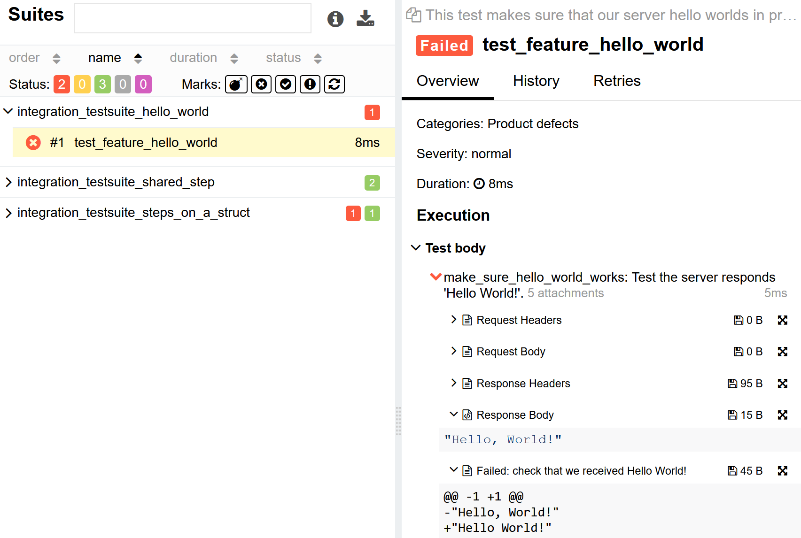

# allure-rust

HTTP integration testing in Rust producing [Allure](https://docs.qameta.io/allure/) compatible outputs.

```rust
// Unnamed tests take the function name as the test name
#[allure_test(
    test_description = "This test makes sure that our server hello worlds in proper manner."
)]
async fn test_feature_hello_world(test_helper: &mut TestHelper) -> anyhow::Result<()> {
    let server = Server::new(0).await;
    let addr = server.addr;
    server.spawn_serve();

    make_sure_hello_world_works(addr, test_helper).await?;
}

#[allure_step(step_description = "Test the server responds 'Hello World!'.")]
pub async fn make_sure_hello_world_works(
    addr: SocketAddr,
    test_helper: &mut TestHelper,
) -> anyhow::Result<String> {
    let client = test_helper.client();
    let builder = client.request(Method::GET, format!("http://{}/", addr));
    let res = client
        .execute(builder.build().unwrap())
        .await?
        .text()
        .await?;
    test_helper
        .asserter()
        .assert_that(&res)
        .is_equals_to("Hello World!", Some("check that we received Hello World!"))
        .await?;
    Ok(res)
}
```

<p>

</p>

More examples can be found under [examples](./examples), to explore them simply:

```bash
$ cd examples
$ cargo test # or cargo nextest r
...
$ allure serve allure-results
```

and wait for your browser to open.

### Documentation

There are two macros, `allure_test` and `allure_step`. All `allure_step`s should be used within an `allure_test`. Every
function has to accept a `test_helper: &mut TestHelper` as one of its arguments. The `allure_test` macro provides
the `TestHelper`.

#### `#[allure_test(test_description = "test_description", test_name = "test_name", allure_dir = "my_allure_dir")]`

- `test_description`: mandatory description of the test.
- `test_name`: optional name of the test, defaults to the function name.
- `allure_dir`: optional directory to store the allure results, defaults to `./allure-results`.

#### `#[allure_step(step_description = "step_description")]`

- `step_description`: mandatory description of the step.